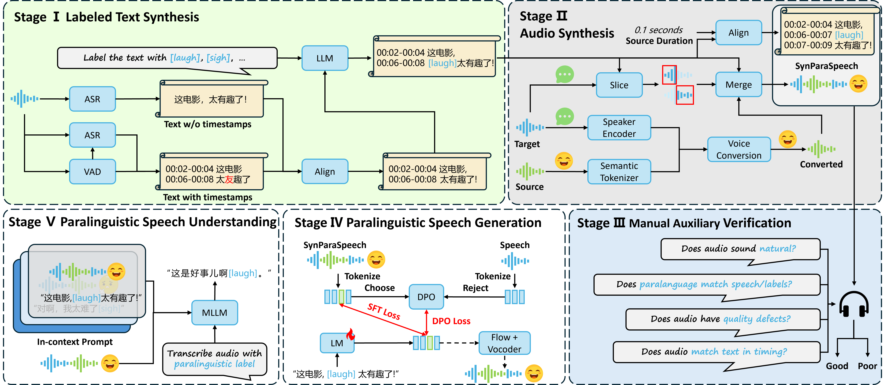

# SynParaSpeech: Automated Synthesis of Paralinguistic Datasets for Speech Generation and Understanding

<div align="center">
    <p>
    <!-- 若有logo可添加： -->
    </p>
    <a href="https://arxiv.org/abs/2509.14946"></a>
    <a href="https://shawnpi233.github.io/SynParaSpeech"></a>
    <a href="https://huggingface.co/datasets/shawnpi/SynParaSpeech"></a>
<!--     <a href="README_zh.md"></a> -->
    <a href="https://creativecommons.org/licenses/by-nc-nd/4.0/"></a>
</div>

SynParaSpeech is the **first automated syntheis framework** designed for constructing large-scale paralinguistic datasets, enabling more realistic speech synthesis and speech understanding. It addresses critical issues in existing resources by generating high-quality data with paralinguistic sounds (e.g., laughter, sigh, throat clearing) that are fully aligned with speech, text, and precise timestamps.

Unlike traditional paralinguistic datasets limited by missing speech, incomplete annotations, or poor realism, **SynParaSpeech** unifies:
- 🤖 Automated synthesis of paralinguistic speech-text pairs
- ⏱️ Precise timestamp annotations for paralinguistic event localization
- 📊 Dual support for paralinguistic Text-to-Speech (TTS) and event detection tasks


## ✨ Highlights

- 🚀 **First automated synthesis pipeline** for large-scale paralinguistic dataset construction, eliminating reliance on labor-intensive manual annotation.  
- 🌍 Covers **6 fine-grained paralinguistic categories**: sigh, throat clearing, laugh, pause, tsk, gasp (matches natural conversational distribution).  
- 🎧 **118.75 hours of data** with 79,986 clips, including millisecond-level timestamps for paralinguistic events (aligned with speech/text).  
- 🎤 Enhances TTS models (CosyVoice2, F5-TTS) via **SFT + DPO optimization**: CosyVoice2 achieves 3.46 PMOS (paralinguistic quality) with DPO-Joint, outperforming baselines.  
- 🔍 Improves paralinguistic event detection (Qwen 2.5 Omni, Kimi Audio) via prompt tuning: Qwen 2.5 Omni reaches 47.3% accuracy and 47.1% macro F1 with 5-shot context.  


## 📊 Pipeline Overview

  
*The pipeline consists of 5 core stages:*  
1. **Labeled Text Synthesis**: Generate timestamped text via 3 ASR models (Whisper Large V3, SenseVoice, Paraformer) + majority voting, then insert paralinguistic tags with Deepseek Chat V3.  
2. **Audio Synthesis**: Integrate paralinguistic audio (voice conversion via SeedVC) with speech audio (sliced by timestamps) to maintain timbre consistency.  
3. **Manual Auxiliary Verification**: Evaluate 4 dimensions (naturalness, paralinguistic matching, audio quality, temporal alignment) to retain high-quality clips.  
4. **Paralinguistic Speech Generation**: Optimize TTS models with SFT and DPO for better paralinguistic integration.  
5. **Paralinguistic Speech Understanding**: Prompt-tune MLLMs to detect paralinguistic events.  


## 🗞 News

- **[2025-09-18]** 🎉 Initial release of arxiv paper.
- **[2025-09-20]** 🎉 Initial release of demo page.
- **[2025-09-22]** 🎉 Initial release of HuggingFace dataset demo.
- 
### 📅 Release Plan
- [x] Demo page
- [x] SynParaSpeech demo dataset
- [ ] SynParaSpeech full dataset
- [ ] Fine-tuned TTS model checkpoints


## 📦 Dataset

### 📌 SynParaSpeech Details

| Feature                | Specification                                                                 |
|------------------------|-------------------------------------------------------------------------------|
| Total Duration         | 118.75 hours                                                                  |
| Number of Clips        | 79,986                                                                        |
| Languages              | Chinese                                                                       |
| Paralinguistic Categories | Sigh, throat clearing, laugh, pause, tsk, gasp (balanced distribution: 9.36%–23.76%) |
| Sampling Rate (SR)     | 24 kHz                                                                        |
| Annotations            | Precise timestamps for paralinguistic events, aligned with speech and text    |
| Synthesis Method       | Automated integration: Whisper Large V3 (semantic encoding) + CAM++ (speaker embedding) + SeedVC (zero-shot voice conversion) |


## 🔍 Key Capabilities

### 🔊 Paralinguistic TTS
Fine-tuning state-of-the-art TTS models with SynParaSpeech delivers significant improvements in paralinguistic naturalness:
- **Optimization Methods**: Supports Supervised Fine-Tuning (SFT) and Direct Preference Optimization (DPO, including DPO-Staged and DPO-Joint).  
- **Performance Gains**: 
  - CosyVoice2: PMOS (paralinguistic quality) rises from 1.88 (baseline) to 3.31 (SFT) and 3.46 (DPO-Joint).  
  - F5-TTS: PMOS improves from 1.16 (baseline) to 3.10 (SFT), with NMOS (naturalness) maintained at 4.16.  

### 🎯 Paralinguistic Event Detection
Prompt tuning with SynParaSpeech enhances MLLMs' ability to detect paralinguistic events:
- **Optimal Context**: 5-shot prompts per catergory yield best performance (avoids overload from redundant context).  
- **Key Improvements**:
  - Qwen 2.5 Omni: Accuracy increases from 21.5% (no context) to 47.3% (5-shot), macro F1 from 18.9% to 47.1%.  
  - Kimi Audio: Accuracy reaches 38.2% (5-shot), with CER (character error rate) reduced to 11.11%.  

## 📜 Citation

If you use SynParaSpeech in your research, please cite our work:

```bibtex
@article{bai2025synparaspeech,
  title     = {SynParaSpeech: Automated Synthesis of Paralinguistic Datasets for Speech Generation and Understanding},
  author    = {Bingsong Bai and Qihang Lu and Wenbing Yang and Zihan Sun and Yueran Hou and Peilei Jia and Songbai Pu and Ruibo Fu and Yingming Gao and Ya Li and Jun Gao},
  journal   = {arXiv preprint arXiv:2509.14946},
  year      = {2025}
}
```


## 🙏 Acknowledgement
We thank the open-source communities behind:
- TTS/ASR: [CosyVoice](https://github.com/FunAudioLLM/CosyVoice), [Whisper](https://github.com/openai/whisper), [SenseVoice](https://arxiv.org/abs/2407.04051), [Paraformer](https://www.isca-speech.org/archive/interspeech_2022/gao22b_interspeech.html), [F5-TTS](https://github.com/SWivid/F5-TTS)  , [Stable Whisper](https://github.com/jianfch/stable-ts)
- Voice Conversion: [SeedVC](https://arxiv.org/abs/2411.09943), [CAM++](https://www.isca-speech.org/archive/interspeech_2023/wang23aa_interspeech.html)  
- LLM: [Deepseek V3](https://arxiv.org/abs/2412.19437)  
- Dataset: [NonVerSpeech38k (NVS)](https://github.com/nonverbalspeech38k/nonverspeech38k)

## Star History

<a href="https://www.star-history.com/#ShawnPi233/SynParaSpeech&Date">
 <picture>
   <source media="(prefers-color-scheme: dark)" srcset="https://api.star-history.com/svg?repos=ShawnPi233/SynParaSpeech&type=Date&theme=dark" />
   <source media="(prefers-color-scheme: light)" srcset="https://api.star-history.com/svg?repos=ShawnPi233/SynParaSpeech&type=Date" />
   
 </picture>
</a>

The dataset and code are licensed under **CC BY-NC-ND 4.0** to encourage open research while protecting intellectual property. For commercial use, please contact the corresponding authors (Ya Li, Jun Gao).
